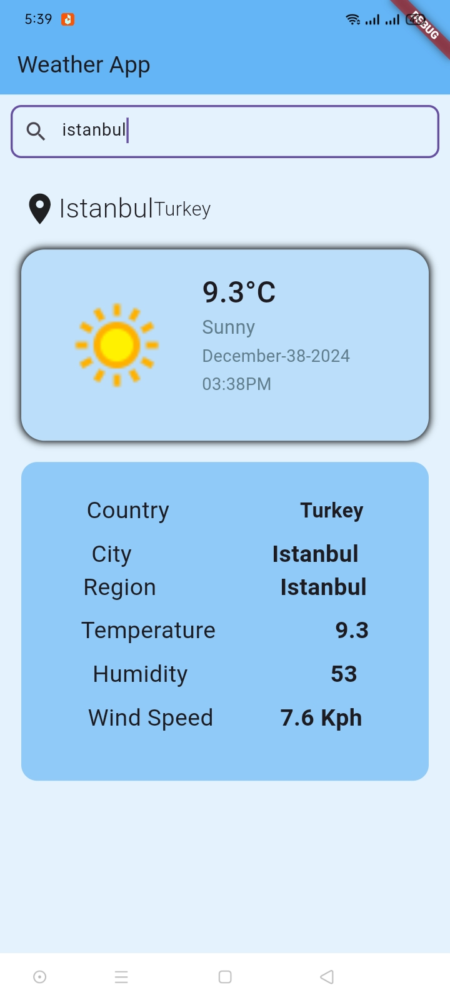

<<<<<<< HEAD
# weather_app

#🌤️ Weather App
A modern and visually appealing Weather App that provides real-time weather updates for any location. Built with Flutter and GetX, this app integrates with a weather API to deliver accurate and up-to-date information.

#Features
🌍 Search for any city to get detailed weather information.
📍 Displays current location's weather (city, country, and region).
🌡️ Shows temperature, humidity, wind speed, and weather conditions (e.g., light snow, overcast).
📅 Includes the current date and time for quick reference.
🎨 Responsive design with a clean and user-friendly interface.

#Tech Stack
Flutter: Ensures a fast, responsive, and cross-platform experience.
GetX: Simplifies state management and API integration.
API Integration: Fetches live weather updates using a weather API.
Why This App?
This app is perfect for Flutter developers looking to:

Learn and implement API integration.
Explore state management with GetX.
Design a clean, modern, and responsive UI.

#Screens of Application

#

